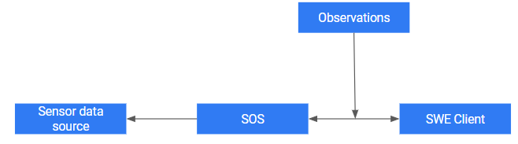
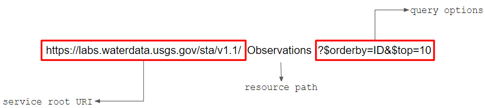

# SensorWeb (Work in Progress!)
This module is designed for students (graduates and undergrads) who want to learn Sensor Web Enablement and SensorthingsAPI in depth. The module is divided into four chapters. In chapter 1, basic concepts are reinforced with relevant examples, and in chapter 2, the SensorWeb data model is thoroughly explained. The SensorThings API is the subject of Chapters 3 and 4. Throughout this course, you will be given quizzes and exercises to complete before moving on to the next chapter to test your understanding. The quizzes do not determine the pass/fail grade.

## Prerequisite
One must satisfy these conditions before diving into the concepts:
+ Knowledge of how the internet and the World Wide Web operate from a server/client standpoint
+ Familiarity with JavaScript Object Notation (JSON).

**Time Duration: 45min**

Now, I welcome you all for this journey

## Table of Contents  
1. [Introduction](#introduction)  
2. [O&M model](#o&M-model)
3. [SensorThings API](#sensorthings-API)
4. [Practical Session](#practical-session)

# Introduction
Because [IP-based](https://en.wikipedia.org/wiki/Internet_Protocol) sensors are becoming more affordable, anyone can gather and refine detailed environmental information about the world around us. This way, citizens of any background can use these sensors to generate publicly available data. Of course, as with anything based on the Internet, as the amount of information and the variety of sources grows, so does the quality range of the available information. Organizations that maintain their own sensor networks specific to their software and hardware systems are transitioning to open standards. Even if they do not intend to publish their data on the Internet, they do intend to communicate via IP-based networks. Each and every sensor data source can have different formats and information. This poses an issue when exchanging sensor data. Let's have a look into Sensors and Sensor Data.

## Sensor Data
Sensor Data is the output of a device that detects and responds to some type of input from the physical environment. The output may be used to provide information or input to another system or to guide a process. Sensors can be used to detect just about any physical element. Here are a few examples of Sensors, just to give an idea of the number and diversity of their applications:

+ A photosensor detects the presence of visible light, infrared transmission (IR) and/or ultraviolet (UV) energy. 
+ A temperature sensor detects the land surface temperature on the ground.

Did you know? 
> Your smartphone is so smart that it can act as a mobile sensor

Using Sensor Data over other spatial data sources such as remote sensing imageries, CAD, orthophotos have numerous advantages. It fills the gaps in the remote sensing data and gives accurate results. It also works 24/7 and can work in harsher climates. Sensors are referred to as "things" within the Internet of Things ecosystem. A Sensor Network is a network of many, spatially distributed devices that use Sensors to monitor environmental conditions like temperature and pressure. A Sensor Web is a collection of Sensor Data and Sensor Networks that can be found and accessed via standard protocols and are accessible via the web (APIs).Through interoperable formats and Web services, the Open Geospatial Consortium (OGC) aims to make heterogeneous Sensor Data discoverable, accessible, and usable. Standards such as Hyper Text Markup Language (HTML) and Hypertext Transfer Protocol (HTTP) enabled the exchange of any type of information on the Internet. The heterogeneity/complexity of different sensor types and measurement outputs is hidden from end users through standardized formats and services.

## SWE

Sensor Web Enablement (SWE) standards from the OGC enable developers to discover, access, and use all types of sensors, transducers, and sensor data repositories via the Web. The Observation & Measurement (O&M) standard, in particular, defines how to model observations, while the Sensor Model Language (SensorML) standard represents metadata about the observing sensor. The following is an overview of key SWE standards. Where applicable, a sufficient description of the standard is included. 

<p align='center'>
  
</p>

Fig 1: Simplified version of the SWE Component's diagram

| OGC Standards | Description |
|---------------|-------------|
| O&M | defines conceptual models for encoding sensor observations and measurements in both archived and real-time formats |
| SensorML | an XML Schema for describing sensors systems and processes eg, Metadata about the Sensors |
| SWE Common Data Model | specifies low-level data models for exchanging sensor-related data between SWE framework |
| SOS | central web service within the SWE framework for performing CRUD operations. This is the bridge that connects a client to an observation repository or a near real-time sensor channel eg, With SOS one can retrieve information about the sensorencoded in sensorML |
| SPS | a web service interface for requesting user-driven acquisitions and observations. This functions as a bridge between a client and a sensor collection management environment |
| SensorThings API | allows homogeneous access to heterogeneous sensors within the Web of Things approach |

Some standards are not considered OGC standards, but they are permitted in the services provided within the SWE framework. All of these documents are provided by OGC standards. <br/>
| Web Service Protocals | Description |
| --------------------- | ----------- |
| SAS | a discussion paper published by the OGC that describes a web service interface for publishing and subscribing to sensor alerts |
| WNS | a document describing the web service interface for [asynchronous](https://www.microfocus.com/documentation/silk-performer/205/en/silkperformer-205-webhelp-en/GUID-6CC17B5B-71B7-4703-B9E6-C81835A5335A.html) message or alert delivery from SAS and SPS or other web services long-running transactions. |

####  Quiz (Intro part 1) seperate modules H5P format

# O&M model
<p align='center'>
  
</p>

Fig 2: Simplified version of the Observation and Measurements (O&M) model's general schema diagram from Best practises documentation[1]

O&M standard defines models and XML schemas for observations as well as features involved when making an observation. O&M creates a high-level framework for representing sensor observations, measurements, procedures, and metadata for the implementation of SWE-enabled architectures. O&M evolves into a common, standardized data model for handling measurements in a wide range of sensors, from thermometers within a closed environment to satellite images of the Earth from space.  O&M, in conjunction with other SWE framework open standards such as SensorML and Sensor Observation Service (SOS), provides a system-independent, internet-enabled method of data exchange between different parts of sensor networks and other systems using sensor information.

> Did you Know ? <br/>
The O&M concepts serve as the foundation for the EU-wide INSPIRE data models for meteorological, climatological, and air quality information, as well as the structure and capabilities of various environmental observation networks.

<p align='center'>
  
</p>
Fig 3: Modified version of Observation Entity diagram from Best Practises documentation[1]

Let's take a look at each entity from the Observation Entity Diagram:

According to OGC Standards[2],
> an observation is an act associated with the process that measures an observed property at a specific feature of interest for a specific phenomenon time and records the results. 

To define each entity separately, we will use a generic example: `temperature`. 

Mandatory Properties of an Observation Model
| Entity | Description | Example |
| ------ | ----------- | --------------- |
| `Observed Property / Phenomenon` | a property measured by a sensor | Temperature |
| `Feature of Interest (FoI)` | an abstraction of a real world phenomena which has been georeferenced | Park |
| `Phenomenon Time` | the time instant or period of when the observation happens | 2022-03-06T05:00:00.000Z |
| `Result` | the estimated value of an observedproperty from the Observation | 12°c |
| `Result Time` | the time at which a result is posted following post processing by a sensor | 2022-03-07T05:00:00.000Z |

Optional Properties of an Observation Model
| Entity | Description | Examples |
| ------ | ----------- | -------- |
| `Result Quality` | describes the quality of the result owing to the fact that sensor data can be faulty to some extent | 
| `Valid Time` | the time period during which the result may be used. With real time sensor data available, the data is measured and replaced within seconds in some cases | 2022-03-07T05:00:00.000Z |
| `Parameter` | describe any event-specific parameter(could be an environmental, an instrument setting or input) | Altitude |
| `Process` | the process that performs the measurement |  change in resistance of the electric current in a sensor measures temperature |

Note: Parameter is not a feature of interest. A `park` may be the feature of interest in the temperature example, but since temperature varies with altitude, `altitude` may be an event-specific parameter.

Look at the exemplary dataset from the United States Geological Survey [USGS](https://www.usgs.gov/) hoisted in the FRaunhofer Opensource SensorThings(FROST)-Server .

> https://labs.waterdata.usgs.gov/sta/v1.1/Observations

### Classification of observation by result type
The Observation model approaches data from the perspective of the data user, emphasizing the semantics of the feature-of-interest and its properties( whether the feature-of-interest is a discrete or continous observation)

1. Observations whose result is constant

Observations have a single or multiple values, but if there are multiple values, those values do not change over the course of an observation with respect to either space or time.


Fig 4: simplified diagram of O&M discrete observations from best practises documentation[1]

Example, Flip-a-Coin, where the odds are always 'HEAD' or 'TAIL' - This would be a Boolean type observation.

How about something in GeoSpatial Context?

Buildings and Roads that have distinct boundaries or limits are considered discrete features. In mapping, discrete data can be shown as a point, line, or a polygon. Points could be cities, lines could be road networks, and polygons could be provinces in a country. This features would be Geometry type observation.

2. Observations whose result varies

Observations where the outcome includes multiple values that change with time, space, or both during the course of the observation. The value of a corresponding observation result shall therefore be a function or coverage(domain extent is the spatiotemporal extent of the feature), respectively. The target feature may be subjected to numerous observations using various sampling methods, so the sampling methods are associated with the act of observation rather than being inherent in the feature-of-interest. To model the coverage, a domain geometry decomposition with specialized sub-geometries is defined to represent the associated feature.


Fig 5: Simplified diagram of O&M continous observations from best practises documentation[1]

Example, 'Temperature' for example, changes over space and time. Here temperature is a discretePointCoverage observation.

Think of any continous observation?

#### Sources of Sensors

W have different Sources of Sensors depending on its location, 
1. Stationary in-situ, 
2. Mobile in-situ, 
3. Stationary Remote sensors. 

Lets see each one with an apt example, <br/>
**Stationary in-situ** : As the name suggests these sensors have fixed positions which is directly associated with the Feature of Interest. <br/>
**Mobile in-situ** : Mobile sensors vary in space rather than being fixed at a specific geo-location. As a result, the sensor's location changes with time. <br/>
**Stationary Remote** : A remote sensor is not physically connected to its associated feature of interest, in contrast to in-situ sensors. However, the sensor's or procedure's own georeference is constant (stationary). <br/>

####  Quiz (Intro part 2) seperate modules H5P format

## Sensor Observation Service

The Sensor Observation Service (SOS) defines a web service interface for retrieving observations and sensor metadata. The service interface also allows new observations to be published, as well as sensor registration and removal.

Latest version specification can be downloaded from,

> http://www.opengeospatial.org/standards/sos

The SOS Implementation Standard is a key component of the SWE architecture, defining network-centric data representations and operations for accessing and integrating sensor data. This observation data may have been collected by in-situ sensors (e.g. river gauges), moving sensor platforms (e.g. satellites or
unmanned aerial vehicles) or networks of static sensors (e.g. seismic arrays).

The following list presents examples of SOS usage: <br/>
+ The US National Oceanic and Atmospheric Administration (NOAA) provides quality controlled ocean data and information through its Integrated Ocean Observing System (IOOS®) SOS: 
+ Wales Air’s Sensor Observation Service (SOS) provides a machine readable access point for air pollution measurements hosted on Air quality Wales: https://airquality.gov.wales/sos-waq/service?service=SOS&request=GetCapabilities



Fig 6: Modified SOS diagram from OGC elearning site[3]

SWE specifications such as SOS, SPS, and SES are powerful for use cases that are broad and often complex (e.g., disaster management or early warning systems). However, use cases that do not require the full functionality of SWE's data altering, sensor discovery, tasking, and event handling may be easier to realize with the Web of Things approach by treating sensor objects as things (Liang et al.). The SWE framework is a well-established approach for integrating sensors with the Web. A smart device, according to Bröring et al. (2011 b), may respond to data requests using SWE-standardized formats. To be more specific, sensor metadata should be encoded using SensorML and observation data as O&M. With these format constraints, any other application or component may retrieve the smart device's sensor data in an interoperable, standardized manner. The SensorThings API is an open standard that builds on Web protocols and the OGC Sensor Web Enablement standards and applies an easy-to-use REST-like style.

# SensorThings API

The Internet of Things (IoT) is a network of physical objects "things" embedded with sensors, software, and other technologies for connecting and exchanging data with other devices and systems via the internet. In the context of Sensorweb, the `things` here are `Sensors`. Physical things (e.g, Sensors) can share and collect data with minimal human intervention thanks to low-cost computing technologies. The Web of Things (WoT) is a set of standards developed by the World Wide Web Consortium (W3C) to improve the interoperability, and usability of the Internet of Things (IoT). From a technological standpoint, this means that the smart device (e.g., a sensor) is addressable via standard HTTP operations (GET, POST, PUT, etc.), enabling [RESTful](https://www.codecademy.com/article/what-is-rest) access to sensor data (Bröring et al, 2011 a). In short, WoT is a subset of IoT and is based on software standards like REST, HTTP, and URIs to allow devices to communicate with one another.

The OGC SensorThings API is recommended for organizations that require web-based platforms to manage, store, share, and analyze IoT-based sensor observation data. Application developers can use this open standard to connect to various IoT devices and create innovative applications without having to worry about the heterogeneous protocols of various IoT devices, gateways, and services. (Liang et al, 2016)

Github repository for OGC sensorthings API:
> https://github.com/opengeospatial/sensorthings

The SensorThings API may simplify connections between devices-to-devices and devices-to-applications by utilizing efficient REST binding, including a reduced JSON encoding, and the MQTT protocol for sensor access making it a lightweight SWE approach. The OGC SensorThings API data model consists of two parts: (1) the Sensing part and (2) the Tasking part. The Sensing part allows IoT devices and applications to CREATE, READ, UPDATE, and DELETE (i.e., HTTP POST, GET, PATCH, and DELETE) IoT data and metadata in a SensorThings service.

## SensorThings API - Sensing Part

<p align='center'>
  
</p>

Fig 7: An abstracted SensorThings API entity diagram

The Sensing part is designed based on the OGC/ISO Observation and Measurement (O&M) model. A Thing represents an IoT device or system. A Thing has a Location that is associated with one or more Datastreams. Each Datastream has many Observations from the Sensor and observes one ObservedProperty with one Sensor. Each Observation read by the Sensor identifies a single FeatureOfInterest. These relationships, when combined, provide a flexible standard way to describe and model any sensing system. It enables SensorThings to function as a unified data exchange system for heterogeneous devices across any organization. 

| Terms | Definitions | Example |
| ----- | ----------- | ------- |
| `Things` | The OGC SensorThings API adheres to the ITU-T definition, which states that a thing is an object of the physical world (physical things) or the information world (virtual things) that can be identified and integrated into communication networks [ITU-T] | Temperature Monitoring System |
| `Location` | The Location entity locates the Thing or the Things it associated with. A Thing’s Location entity is defined as the last known location of the Thing | Park |
| `Historical Location` | The times of the current (i.e., last known) and previous locations of the Thing | 2021-10-14T18:51:47.342Z |
| `DataStream` | A Datastream groups a collection of Observations measuring the same ObservedProperty and produced by the same Sensor |
| `ObservedProperty` | An ObservedProperty specifies the phenomenon of an Observation | Temperature |
| `Sensor` | an instrument that observes a property or phenomenon | Temperature Sensor |
| `Observation` | an act associated with the process that measures an observed property at a specific feature of interest for a specific phenomenon time and records the results |

Lets take a look into this ROOT URI again:
> https://labs.waterdata.usgs.gov/sta/v1.1/

### URI Components
The first step in performing CRUD actions on resources is to address the target resource(s) via URI. The service root URI, the resource path, and the query options are the three major URI components used here. Furthermore, the service root URI is made up of two parts: (1) the SensorThings service's location and (2) the version number. 

The version number is formatted as shown : "v"majorversionnumber + "." + minorversionnumber

Example URI,  
<p align='center'>
  
</p>

Clients can address to different types of resources by appending the resource path after the service root URI, such as an entity set, an entity, a property, or a navigation property. Finally, after the resource path, clients can use query options to further process the addressed resources, such as sorting by properties or filtering with criteria.

### Resource Path
The resource path follows the service root URI and can be used to access various entities.

| Usage of Resource Path |  URI | Description |
| ---------------------- | ---- | ----------- |
| no resource path | https://labs.waterdata.usgs.gov/sta/v1.1/ | List all the Entity types in a JSON format |
| address an entity set | https://labs.waterdata.usgs.gov/sta/v1.1/Observations | List the Observed Properties of all entities |
| addresses to an specific entity | https://labs.waterdata.usgs.gov/sta/v1.1/Observations('991a6f6c-db7e-11ec-808f-d73c88214e23') | List only the specified entity from a collection of entity set |
| address to a property | https://labs.waterdata.usgs.gov/sta/v1.1/Observations('991a6f6c-db7e-11ec-808f-d73c88214e23')/result | List the property of the specified entity from a collection of entity set |
| address to the property value | https://labs.waterdata.usgs.gov/sta/v1.1/Observations('991a6f6c-db7e-11ec-808f-d73c88214e23')/result/$value | List only the value of the specified entity property from a collection of entity set |

Each and every entity set holds one or more relationship with other entity set. This relationship can be accessed via navigation and association links. The service then returns one or many entities that hold a certain relationship with the specified entity.

+ address to a navigation property
> https://labs.waterdata.usgs.gov/sta/v1.1/Datastreams('0dbbd0a0480c46bd91e67181455231ca')/Observations 
+ address to an association property
> https://labs.waterdata.usgs.gov/sta/v1.1/Datastreams('0dbbd0a0480c46bd91e67181455231ca')/Observations/$ref 

Note : users can use navigation properties to link from one entity set to another, users can further extend the resource path with unique identifiers, properties, or links

### Entities
The OGC SensorThings API service organizes similar entity types into entity sets. Each entity has an unique id as well as one-to-many properties. Furthermore, when an entity has a relationship with entities from other entity sets, this type of relationship is expressed using navigation properties (i.e., navigationLink and associationLink).

| Property | Description | Multiplicity and Use | Example |
| -------- | ----------- | -------------------- | ------- |
| `id` | ID is a system-generated unique identifier of an entity | One (Mandatory) | USGS-340422107370801 |
| `selfLink` | unique URL of an entity | One (Mandatory) | https://labs.waterdata.usgs.gov/sta/v1.1/Things('USGS-340422107370801') |
| `navigationLink` | relative URL that connects relevant information about the entity | One to Many (Mandatory) | Locations@iot.navigationLink |

a) Things

A Thing has one or more Datastreams in which Observations are collected. It is possible to create Things with nested linked Location and Datastream as well as Things without a Location and Datastream. A thing has many to many relationship with Locations. 

| Property | Description | Multiplicity and Use | Example |
| -------- | ----------- | -------------------- | ------- |
| `name` | A label for the Thing | One (Mandatory) | USGS-340422107370801 |
| `description` | short description of the corresponding Thing entity | One (Mandatory) | Well |
| `properties` | A JSON Object containing user-annotated properties as key-value pairs | Zero to One | State |

Example link : https://labs.waterdata.usgs.gov/sta/v1.1/Things('USGS-340422107370801')

```
{
"description": "Well",
"@iot.id": "USGS-340422107370801",
"name": "USGS-340422107370801",
"properties": {
  "state": "New Mexico",
  "monitoringLocationAltitudeLandSurface": "6981"
},
"@iot.selfLink": "https://labs.waterdata.usgs.gov/sta/v1.1/Things('USGS-340422107370801')",
"Locations@iot.navigationLink": "https://labs.waterdata.usgs.gov/sta/v1.1/Things('USGS-340422107370801')/Locations",
"MultiDatastreams@iot.navigationLink": "https://labs.waterdata.usgs.gov/sta/v1.1/Things('USGS-340422107370801')/MultiDatastreams",
"HistoricalLocations@iot.navigationLink": "https://labs.waterdata.usgs.gov/sta/v1.1/Things('USGS-340422107370801')/HistoricalLocations",
"TaskingCapabilities@iot.navigationLink": "https://labs.waterdata.usgs.gov/sta/v1.1/Things('USGS-340422107370801')/TaskingCapabilities",
"Datastreams@iot.navigationLink": "https://labs.waterdata.usgs.gov/sta/v1.1/Things('USGS-340422107370801')/Datastreams"
}

```
b) Location

The Location entity is responsible for locating the Thing or Things with which it is associated. A Thing's Location entity is defined as the Thing's last known location. There is a chance that a thing's location matches its observations' feature of interest. For IoT applications, especially those involving in-situ sensing, the Thing's location is typically the primary location of interest.

| Property | Description | Multiplicity and Use | Examples |
| -------- | ----------- | -------------------- | -------- |
| `name` | a label for Location entity | One (Mandatory) | USGS-340422107370801 |
| `description` | short description of the corresponding Location entity | One (Mandatory) | Well |
| `encodingType` | GeoJSON encoding type of location property | one (Mandatory) | application/vnd.geo+json |
| `location` | Geographical Position of an entity is defined by encodingType | One (Mandatory) | type, coordinates |

Example link : https://labs.waterdata.usgs.gov/sta/v1.1/Locations('c88aafd6-2d1f-11ec-a798-3b0d4f0899e6')

```
{
"description": "Well",
"encodingType": "application/vnd.geo+json",
"@iot.id": "c88aafd6-2d1f-11ec-a798-3b0d4f0899e6",
"location": {
  "type": "Point",
  "coordinates": [-107.61885,34.07285]
},
"name": "USGS-340422107370801",
"@iot.selfLink": "https://labs.waterdata.usgs.gov/sta/v1.1/Locations('c88aafd6-2d1f-11ec-a798-3b0d4f0899e6')",
"HistoricalLocations@iot.navigationLink": "https://labs.waterdata.usgs.gov/sta/v1.1/Locations('c88aafd6-2d1f-11ec-a798-3b0d4f0899e6')/HistoricalLocations",
"Things@iot.navigationLink": "https://labs.waterdata.usgs.gov/sta/v1.1/Locations('c88aafd6-2d1f-11ec-a798-3b0d4f0899e6')/Things"
}

```
c) HistoricalLocation

A Thing’s HistoricalLocation entity set provides the times of the current (i.e., last known) and previous locations of the Thing. The HistoricalLocation can also be created, updated and deleted.

| Property | Description | Multiplicity and Use | Example |
| -------- | ----------- | -------------------- | ------- |
| `time` | Last known time of the Thing at the location | One (Mandatory) | 2021-10-14T18:51:47.342Z |

Example link : https://labs.waterdata.usgs.gov/sta/v1.1/HistoricalLocations('c88af4fa-2d1f-11ec-a798-4b21ccc3d035')

```
{
"@iot.id": "c88af4fa-2d1f-11ec-a798-4b21ccc3d035",
"@iot.selfLink": "https://labs.waterdata.usgs.gov/sta/v1.1/HistoricalLocations('c88af4fa-2d1f-11ec-a798-4b21ccc3d035')",
"time": "2021-10-14T18:51:47.342Z",
"Locations@iot.navigationLink": "https://labs.waterdata.usgs.gov/sta/v1.1/HistoricalLocations('c88af4fa-2d1f-11ec-a798-4b21ccc3d035')/Locations",
"Thing@iot.navigationLink": "https://labs.waterdata.usgs.gov/sta/v1.1/HistoricalLocations('c88af4fa-2d1f-11ec-a798-4b21ccc3d035')/Thing"
}
```

d) DataStream

A Datastream groups a collection of Observations measuring the same ObservedProperty that are produced by the same Sensor.

| Property | Description | Multiplicity and Use | Example |
| -------- | ----------- | -------------------- | ------- |
| `name` | A label for the Datastream entity | One (Mandatory) | 40c9fdb920924c43b1afdc4f24ce54ea |
| `description` | The description of the Datastream entity | One (Mandatory) | Water level, depth LSD / USGS-340422107370801-40c9fdb920924c43b1afdc4f24ce54ea |
| `unitOfMeasurement` | A JSON Object containing three key-value pairs: name, symbol, definition for the symbol used | One (Mandatory) | name, symbol |
| `observationType` | The type of Observation (with unique result type), which is used by the service to encode observations | One (Mandatory) | Instantaneous |
| `observedArea` | The spatial bounding box of the spatial extent of all FeaturesOfInterest that belong to the Observations associated with this Datastream | Zero to One (Optional) | here, Type and coordinates in Geojson encoding |
| `phenomenonTime` | The temporal interval of the phenomenon times of all observations belonging to this Datastream | Zero to One (Optional) | 2021-08-15T19:00:00.000Z/2022-05-26T17:00:00.000Z |
| `resultTime` | The temporal interval of the result times of all observations belonging to this Datastream | Zero to One (Optional) | null |

ObservationType has data types derived from Observation and Measurement Model. Check out the 'Classification of observation by result type' section of this article. 

Example link : https://labs.waterdata.usgs.gov/sta/v1.1/Datastreams('40c9fdb920924c43b1afdc4f24ce54ea')

```
{
"description": "Water level, depth LSD / USGS-340422107370801-40c9fdb920924c43b1afdc4f24ce54ea",
"@iot.id": "40c9fdb920924c43b1afdc4f24ce54ea",
"name": "40c9fdb920924c43b1afdc4f24ce54ea",
"observationType": "Instantaneous",
"observedArea": {
  "type": "Point",
  "coordinates": [-107.61885,34.07285]
},
"phenomenonTime": "2021-08-15T19:00:00.000Z/2022-05-26T17:00:00.000Z",
"properties": {
  "ParameterCode": "72019",
  "StatisticCode": "00011"
},
"resultTime": null,
"@iot.selfLink": "https://labs.waterdata.usgs.gov/sta/v1.1/Datastreams('40c9fdb920924c43b1afdc4f24ce54ea')",
"unitOfMeasurement": {
  "name": "Feet",
  "symbol": "ft",
  "definition": ""
},
"Observations@iot.navigationLink": "https://labs.waterdata.usgs.gov/sta/v1.1/Datastreams('40c9fdb920924c43b1afdc4f24ce54ea')/Observations",
"Sensor@iot.navigationLink": "https://labs.waterdata.usgs.gov/sta/v1.1/Datastreams('40c9fdb920924c43b1afdc4f24ce54ea')/Sensor",
"ObservedProperty@iot.navigationLink": "https://labs.waterdata.usgs.gov/sta/v1.1/Datastreams('40c9fdb920924c43b1afdc4f24ce54ea')/ObservedProperty",
"Thing@iot.navigationLink": "https://labs.waterdata.usgs.gov/sta/v1.1/Datastreams('40c9fdb920924c43b1afdc4f24ce54ea')/Thing"
}
```

e) Sensor

A Sensor is an instrument that observes a property or phenomenon with the goal of producing an estimate of the value of the property

| Property | Description | Multiplicity and Use | Example |
| -------- | ----------- | -------------------- | ------- |
| `name` | a label for Sensor entity | One (Mandatory) | USGS_Sensor |
| `description` | short description of the corresponding Sensor entity | One (Mandatory) | The USGS Sensor |
| `metadata` | The detailed description of the Sensor or system defined by encodingType. | One (Mandatory) | "" |

A Sensor Metadata Encoding type can be either pdf or SensorML has described above. Most sensor manufacturers provide their sensor datasheets in a PDF format. As a result, PDF is a Sensor encodingType supported by SensorThings API. The second Sensor encodingType is SensorML.

Example link : https://labs.waterdata.usgs.gov/sta/v1.1/Sensors('USGS_Sensor')

```
{
"description": "The USGS Sensor",
"encodingType": "",
"@iot.id": "USGS_Sensor",
"metadata": "",
"name": "USGS_Sensor",
"properties": {},
"@iot.selfLink": "https://labs.waterdata.usgs.gov/sta/v1.1/Sensors('USGS_Sensor')",
"MultiDatastreams@iot.navigationLink": "https://labs.waterdata.usgs.gov/sta/v1.1/Sensors('USGS_Sensor')/MultiDatastreams",
"Datastreams@iot.navigationLink": "https://labs.waterdata.usgs.gov/sta/v1.1/Sensors('USGS_Sensor')/Datastreams"
}
```

f) ObservedProperty

An ObservedProperty specifies the phenomenon of an Observation.

| Property | Description | Multiplicity and Use | Example |
| -------- | ----------- | -------------------- | ------- |
| `name` | A label for the ObservedProperty | One (Mandatory) | Depth to water level, feet below land surface |
| `description` | short description of the Observed Property | One (Mandatory) | Physical |
| `definition` | The URI of the ObservedProperty. | One (Mandatory) | "" |

Example link : https://labs.waterdata.usgs.gov/sta/v1.1/ObservedProperties('72019')

```
{
"description": "Physical",
"definition": "",
"@iot.id": "72019",
"name": "Depth to water level, feet below land surface",
"@iot.selfLink": "https://labs.waterdata.usgs.gov/sta/v1.1/ObservedProperties('72019')",
"Datastreams@iot.navigationLink": "https://labs.waterdata.usgs.gov/sta/v1.1/ObservedProperties('72019')/Datastreams",
"MultiDatastreams@iot.navigationLink": "https://labs.waterdata.usgs.gov/sta/v1.1/ObservedProperties('72019')/MultiDatastreams"
}
```

g) Observation

An Observation is the act of measuring or otherwise determining the value of a property [OGC 10-004r3 and ISO 19156:2011] Check out the Observation and Measurement Model that we discussed in this article.

Example link : https://labs.waterdata.usgs.gov/sta/v1.1/Observations('0ce7bd6c-7e0c-11ec-a1c2-d357d8a6e8ba')

```
{
"@iot.id": "0ce7bd6c-7e0c-11ec-a1c2-d357d8a6e8ba",
"phenomenonTime": "2022-01-20T10:00:00.000Z",
"result": "179.30",
"resultTime": null,
"@iot.selfLink": "https://labs.waterdata.usgs.gov/sta/v1.1/Observations('0ce7bd6c-7e0c-11ec-a1c2-d357d8a6e8ba')",
"FeatureOfInterest@iot.navigationLink": "https://labs.waterdata.usgs.gov/sta/v1.1/Observations('0ce7bd6c-7e0c-11ec-a1c2-d357d8a6e8ba')/FeatureOfInterest",
"Datastream@iot.navigationLink": "https://labs.waterdata.usgs.gov/sta/v1.1/Observations('0ce7bd6c-7e0c-11ec-a1c2-d357d8a6e8ba')/Datastream",
"MultiDatastream@iot.navigationLink": "https://labs.waterdata.usgs.gov/sta/v1.1/Observations('0ce7bd6c-7e0c-11ec-a1c2-d357d8a6e8ba')/MultiDatastream"
},
```

h) Feature of Interest

An Observation results in a value being assigned to a phenomenon. The phenomenon is a property of a feature, the latter being the FeatureOfInterest of the Observation [OGC and ISO 19156:2011]. In the context of the Internet of Things, many Observations’ FeatureOfInterest can be the Location of the Thing. Example, the FeatureOfInterest can be the geographical area or volume that is being sensed.

| Property | Description | Multiplicity and Use | Example |
| -------- | ----------- | -------------------- | ------- |
| `name` | A label for the FeatureOfInterest | One (Mandatory) | FoI for location 5891d7a8-2d1b-11ec-a8de-7be125e05952 |
| `description` | short description of the FeatureOfInterest | One (Mandatory) | Generated from location 5891d7a8-2d1b-11ec-a8de-7be125e05952 |
| `feature` | The detailed description of the feature. The data type is defined by encodingType | One (Mandatory) | type, coordinate |

Example link : https://labs.waterdata.usgs.gov/sta/v1.1/FeaturesOfInterest('7a5bbcd4-2d23-11ec-b026-178e2d48f659')

```
{
"description": "Generated from location 5891d7a8-2d1b-11ec-a8de-7be125e05952",
"encodingType": "application/vnd.geo+json",
"feature": {
  "type": "Point",
  "coordinates": [-96.2429583,30.2123138]
},
"@iot.id": "7a5bbcd4-2d23-11ec-b026-178e2d48f659",
"name": "FoI for location 5891d7a8-2d1b-11ec-a8de-7be125e05952",
"@iot.selfLink": "https://labs.waterdata.usgs.gov/sta/v1.1/FeaturesOfInterest('7a5bbcd4-2d23-11ec-b026-178e2d48f659')",
"Observations@iot.navigationLink": "https://labs.waterdata.usgs.gov/sta/v1.1/FeaturesOfInterest('7a5bbcd4-2d23-11ec-b026-178e2d48f659')/Observations"
},
```

### Query Operations
The use of query options allows for the refinement of requests in order to obtain the necessary information about SensorThings entities in a simple and efficient manner. SensorThings query options are divided into two categories. The first group specifies the properties that the request will return. This group's query options are `$expand` and `$select`. The second group is responsible for limiting, filtering, or re-ordering the request results. This group includes the functions `$orderby`, `$top`, `$skip`, `$count`, and `$filter`.

| Operations | Description | Result |
| ---------- | ----------- | --- |
| `$expand` | to request inline information for related entities in the entity collection requested | /v1.1/Things?$expand=Datastreams |
| `$select` | requests the service to return only the properties explicitly requested by the client | /v1.1/Observations?$select=result,resultTime |
| `$orderby` | sort the response based on properties of requested entity in the specified order | /v1.1/Observations?$orderby=result |
| `$top` | specifies the limit on the number of items returned from a collection of entities | /v1.1/Observations?$top=5 |
| `$skip` | provides the number of the collection's items that must be excluded from the outcome for the query | /v1.1/Observations?$skip=5 |
| `$count` | to retrieve the total number of items in a collection matching the requested entity | /v1.1/Things?$count=true |
| `$filter` | filters a collection of entities that are addressed by a request URL| v1.1/Observations?$filter=Datastream/id eq 1 |


### Difference between SOS and SensorThings API

| Terms | SensorThings API | Sensor Observation Service |
| ----- | ---------------- | -------------------------- |
| Encoding | JSON | XML |
| Architecture Style | Resource Oriented Architecture | Service Oriented Architecture |
| Inserting sensors or observations | HTTP POST and DELETE(e.g., CRUD) | Using SOS interface i.e, InsertSensor(), InsertObservation() |
| Deleting existing sensors or observations | HTTP DELETE | Using SOS interface, DeleteSensor(). SOS doesn't have an option to delete observations | 

Not supported features in SOS that are supported in SensorThings API : <br/>
+ Pagination : $top, $skip, $nextLink
+ Linked data support : JSON-LD
+ Return properties subset and requesting queries : $select, $expand

#### Quiz 1 and 2 (seperate modules) H5P format

# Practical Session 

In this chapter we will learn how to create and read data in the SensorThings API(STA) using an example. We will use Postman for performing CRUD operations using API from 52°North GmbH.

## Setup the environment

### Install Postman (Step 1)
From https://www.postman.com/, "Postman is an API testing platform for creating HTTP requests and checking the response created" <br/>
    
    To download visit postman official page: https://www.postman.com/downloads/ (Here we use postman desktop for our session)
    
### Install Docker (Step 2)
From [IBM](https://www.ibm.com/topics/docker), "Docker is an open source platform that enables developers to build, deploy, run, update and manage containers required to run that code in any environment.
	
	To download visit docker official page: https://docs.docker.com/get-docker/ (You can see guides tailored to your Operating System)
	
### Install STA (Step 3)
After installing postman and docker, Let's install 52North Sensorthings API in our local system. <br/>
To do that, 
1) download the docker.yml file from [this github repository](https://github.com/52North/sensorweb-server-sta/blob/maintenance/3.x/docker-compose.yml)
2) Navigate into the folder with the file in your system
3) Run `docker-compose up` in the folder path
4) With this file all the necessary front and backend actions are activated.
5) Now, check if you have installed the library using : http://localhost:8081/v1.1/

If you can view all the entities that we described above, then the library is running in your system. If not use this github repository `issues` for your doubts.

Whew! That was a tiring task. Now that you have the software environment ready in your pc. Let's go !!!

### Create Data
A weather station at the berlin stadwerke office building, for example, measures the air temperature. Let’s use this as our exemplary dataset for this session.

Root URL : http://localhost:8081/v1.1/

To insert data the first step is to create a Thing with a HTTP POST request. <br/>
a) Create Thing

Open the Postman application. For the Initial setting: [How to use Postman](videos/PracticalSession1.mp4)

1. Add Things to the URL : http://localhost:8081/v1.1/Things

Note: You must always specify `id`,`name`,`description` when creating entities. The `self.Link`,`Navigation.Links`,`association links` are all auto created after sending the response.

2. The body of the request is a json document, as illustrated below. It includes the Thing's unique identifier, name, and description, as well as the Thing's properties(look into the entity table of Thing to know about the properties mentioned in the body)

```
{
  "@iot.id": "Weather_Station_7",
  "name": "Weather Station Home",
  "description": "This is a weather station at a house in the city of berlin.",
  "properties": {
    "owner": "tommy"
  }
}
```

3. Copy the json body that was mentioned above, and then paste it into Postman's body space. <br/>
4. Press SEND. For the thing we created, parameters and navigational links are created in the response. However, if you choose one of the directional links, there is  no data. For navigational links to connect, all the necessary entities must be created.

b) Create Location <br/>
After that a Location needs to be added. In this example the URI for the POST request looks like this: http://localhost:8081/v1.1/Locations

The body of the request is a json document, as illustrated below. It includes the Location’s unique identifier, name, and description, as well as the Location's properties(look into the entity table of Location to know about the properties mentioned in the body)

```
{
  "@iot.id": "building_52",
  "name": "tommy_house",
  "description": "Home Building",
  "encodingType": "application/vnd.geo+json",
  "location": {
    "type": "Feature",
    "geometry":{
      "type": "Point",
      "coordinates": [13.410854165177549,52.51559810321062]
    }
  },
  "Things": [
      {
          "@iot.id": "Weather_Station_7"
      }
  ]
}
```

1. Copy the json body specified above and paste it to the body space in Postman.
2. Click SEND. The response includes the request parameters as well as links to the Location, the Thing, and the HistoricalLocations. The link to the Thing leads to the weather station that was previously added.

c) Create Sensor <br/>
In the next step a Sensor is created. We have two parameters measured by the DHT11 sensor (temperature and humidity)

1. Replace `Locations` and add to the url `Sensors`:http://localhost:8081/v1.1/Sensors

The body of the request is a json document, as illustrated below. It includes the Sensor’s unique identifier, name, and description, as well as the Sensor’s properties(look into the entity table of Sensor to know about the properties mentioned in the body)

For temperature 
```
{
  "@iot.id": "temperature_7",
  "name": "DHT11_sensor",
  "description": "This sensor measures the ambient temperature",
  "encodingType": "application/pdf",
  "metadata": "http://example.org/Thermometer.pdf"
}
``` 
For humidity
```
{
  "@iot.id": "humidity_7",
  "name": "DHT11_sensor",
  "description": "This sensor measures the ambient humidity",
  "encodingType": "application/pdf",
  "metadata": "http://example.org/Humidity.pdf"
}
```
Note: send requests seperately

2. Copy the json body specified above and paste it to the body space in Postman.
3. Click SEND. The response includes the request parameters as well as links to the Sensor and datastream.

d) Create ObservedProperty <br/>
1. Replace Sensors and add to the URL ObservedProperties: http://localhost:8081/v1.1/ObservedProperties

The body of the request contains a unique identifier, a description, a name and a link to the definition of the ObservedProperty(look into the entity table of ObservedProperty to know about the properties mentioned in the body)

For temperature
```
{
  "@iot.id": "air_temperature",
  "description": "Air temperature is the bulk temperature of the air, not the surface (skin) temperature",
  "name": "ir_temperature",
  "definition": "https://vocab.nerc.ac.uk/collection/P07/current/CFSN0023/"
}
```
For humidity
```
{
  "@iot.id": "humidity",
  "description": "",
  "name": "ir_humidity",
  "definition": "https://vocab.nerc.ac.uk/collection/P07/current/CFSN0413/"
}
```

2. Copy and Paste the request in the field of the Body section.
3. Click SEND.

e) Create Datastreams <br/>
1. Replace `ObservedProperties` and add to the URL `Datastreams`: http://localhost:8081/v1.1/Datastreams

2. Paste the request in the field of the Body section(look into the entity table of DataStreams to know about the properties mentioned in the body)

For temperature
```
{
  "@iot.id": "temperature_readings_7",
  "name": "Temperature Readings",
  "description": "This is the reading of a DHT11 sensor.",
  "unitOfMeasurement": {
    "name": "degree Celsius",
    "symbol": "°C",
    "definition": "http://unitsofmeasure.org/ucum.html#para-30"
  },
  "observationType": "http://www.opengis.net/def/observationType/OGC-OM/2.0/OM_Measurement",
  "Sensor": {
      "@iot.id": "temperature_7"
  },
  "ObservedProperty": {
      "@iot.id": "ambient_temperature"
  },
  "Thing": {
      "@iot.id": "Weather_Station_7"
  }
}
```
For humidity
```
{
  "@iot.id": "humidity_readings_7",
  "name": "Humidity Readings",
  "description": "This is the reading of a DHT11 sensor.",
  "unitOfMeasurement": {
    "name": "percentage",
    "symbol": "%",
    "definition": "http://unitsofmeasure.org/ucum.html#para-30"
  },
  "observationType": "http://www.opengis.net/def/observationType/OGC-OM/2.0/OM_Measurement",
  "Sensor": {
      "@iot.id": "humidity_7"
  },
  "ObservedProperty": {
      "@iot.id": "humidity"
  },
  "Thing": {
      "@iot.id": "Weather_Station_7"
  }
}
```

3. Click SEND.

f) Create FeatureOfInterest <br/>
1. Replace `Datastreams` and add to the URL `FeaturesOfInterest` : http://localhost:8081/v1.1/FeaturesOfInterest

2. Paste the request in the field of the Body section(look into the entity table of FeatureOfInterest to know about the properties mentioned in the body)

```
{
  "@iot.id": "berlin",
  "name": "berlin",
  "description": "This is the city of Berlin.",
  "encodingType": "application/vnd.geo+json",
  "feature": {
    "type": "Feature",
    "geometry":{
      "type": "Point",
      "coordinates": [13.414064873302916,52.530875407490306]
    }
  }
}
```

3. Click SEND.

g) Create Observation <br/>
1. Replace `FeatureOfInterest` and add to the URL `Observations`: http://localhost:8081/v1.1/Observations

2. Paste the request in the field of the Body section (look into the entity table of Observation to know about the properties mentioned in the body)

For temperature observation
```
{
  "phenomenonTime": "2022-08-12T15:57:53.00+02:00",
  "resultTime": "2022-08-12T15:57:53.00+02:00",
  "result": 12.4,
  "Datastream": {
      "@iot.id": "temperature_readings_7"
  },
  "FeatureOfInterest": {
      "@iot.id": "berlin"
  }
}
```
For humidity observation <br/>
Note: The timings need not be the same, since the sensor measures both the readings at the same time, we specify the same time to both observations 
```
{
  "phenomenonTime": "2022-08-12T15:57:53.00+02:00",
  "resultTime": "2022-08-12T15:57:53.00+02:00",
  "result": 67,
  "Datastream": {
      "@iot.id": "humidity_readings_7"
  },
  "FeatureOfInterest": {
      "@iot.id": "berlin"
  }
}
```
	
3. Click the SEND button, To make it possible to filter the Observations, add more observations
```
{
  "phenomenonTime": "2022-08-12T16:58:16.00+02:00",
  "resultTime": "2022-08-12T16:58:16.00+02:00",
  "result": 10.3,
  "Datastream": {
      "@iot.id": "temperature_readings_7"
  },
  "FeatureOfInterest": {
      "@iot.id": "berlin"
   }
 }
```
likewise for humidity. 

Now, You have successfully learned how to create a data using SensorthingsAPI.

## Reference
[1] Best Practices for Using Sensor Web Technology by 52north, https://52north.github.io/sensor-web-tutorial/ <br/>
[2] OGC Abstract Specification - Geographic information — Observations and measurements,Cox, Simon (2013), http://portal.opengeospatial.org/files/?artifact_id=41579. <br/>
[3] OGC Elearning site, http://opengeospatial.github.io/e-learning/sos/text/index.html <br/>

### Icon Attribution
Icon by <a href="https://freeicons.io/profile/205927">Flatart</a>, <a href="https://freeicons.io/profile/8908">EDT.Graphics</a>, <a href="https://freeicons.io/profile/75801">Hilmy Abiyyu Asad</a>, <a href="https://freeicons.io/profile/88863">WANICON</a>, <a href="https://freeicons.io/profile/122327">Ginkaewicons</a> on <a href="https://freeicons.io">freeicons.io</a>

### Data Attribution
USGS Water labs hoisted in Frost server, https://labs.waterdata.usgs.gov/index.html
                                
